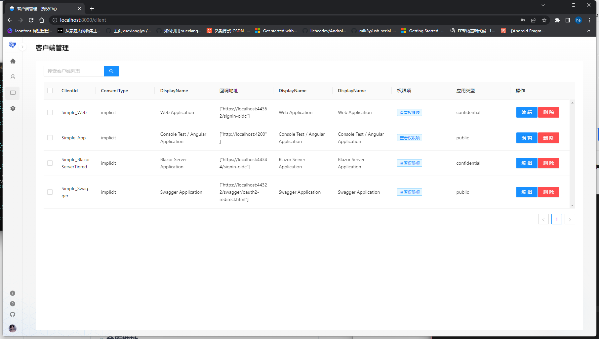
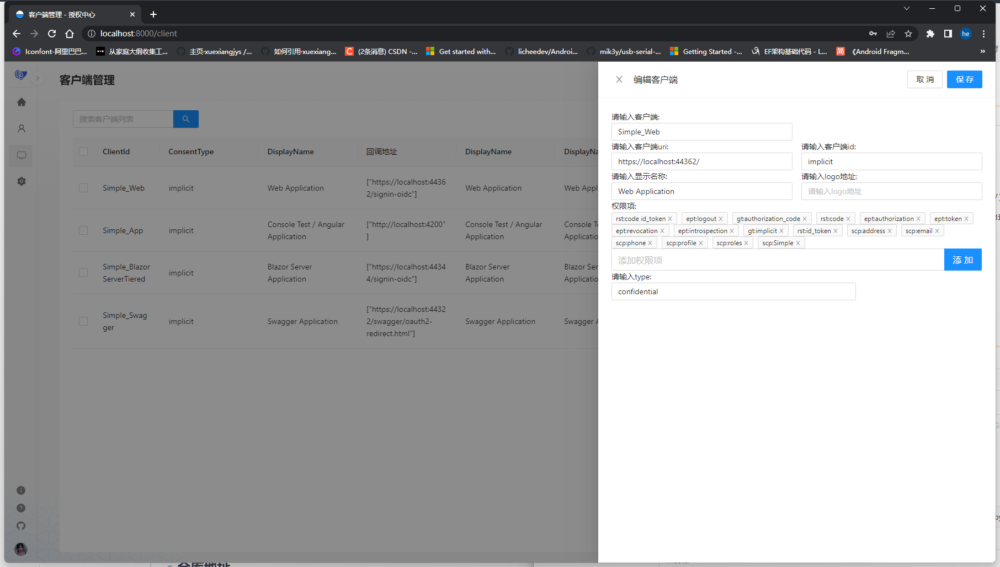

# 👻 openiddict 统一授权认证系统

## 🦄 介绍
统一授权中心
由于[`abp`](https://abp.io/)默认提供的ui功能太少所以开发一个更多管理功能的系统

前端框架采用[`umi`](https://v3.umijs.org/zh-CN/)+[`react`](https://reactjs.org/)+[`antd`](https://ant.design/index-cn/)实现界面管理
后端框架基于[`abp`](https://abp.io/)的[`openiddict`](https://github.com/openiddict/openiddict-corea)实现

## 🕸️界面

